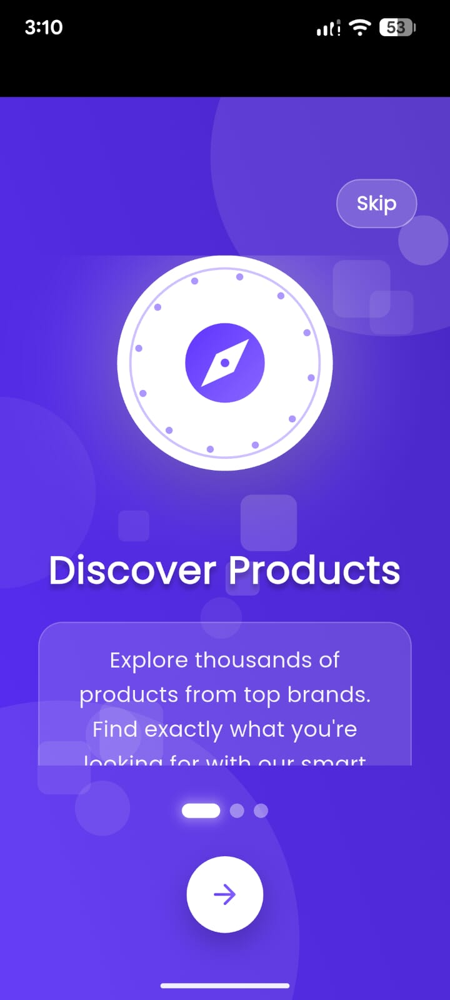
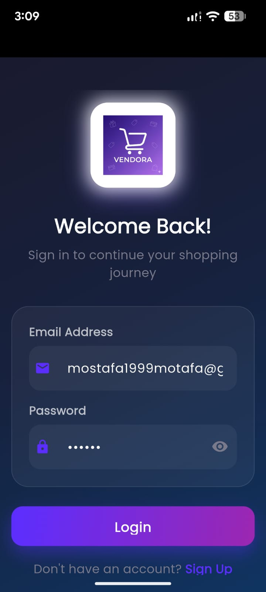
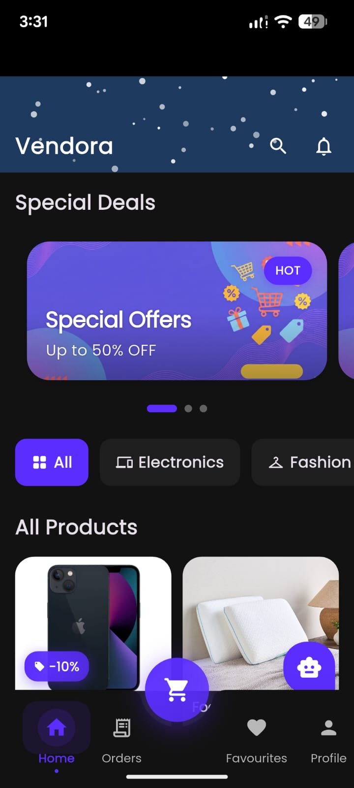
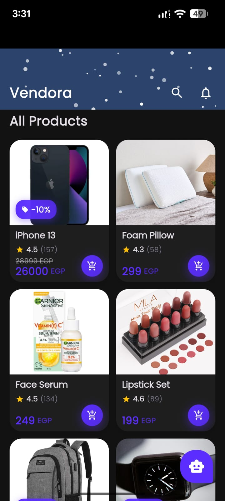
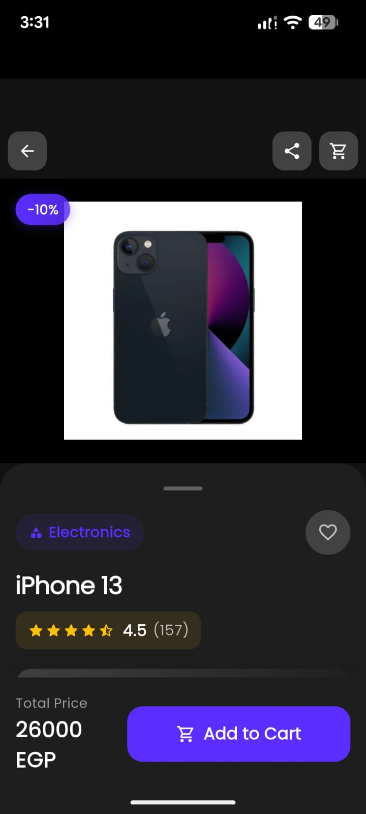
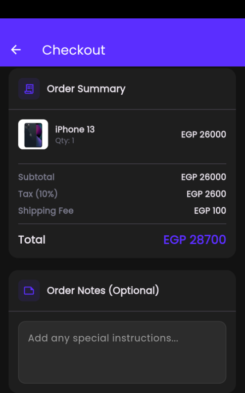

# 🛍️ Vendora - E-Commerce Mobile Application

<p align="center">
  
</p>

<p align="center">
  <strong>A Modern E-Commerce Experience Built with Flutter</strong>
</p>

<p align="center">
  <a href="#features">Features</a> •
  <a href="#screenshots">Screenshots</a> •
  <a href="#architecture">Architecture</a> •
  <a href="#installation">Installation</a> •
  <a href="#tech-stack">Tech Stack</a> •
  <a href="#team">Team</a>
</p>

---

## 📋 Table of Contents

- [Overview](#overview)
- [Features](#features)
- [Screenshots](#screenshots)
- [Architecture](#architecture)
- [Project Structure](#project-structure)
- [Tech Stack](#tech-stack)
- [Installation](#installation)
- [Configuration](#configuration)
- [Team](#team)
- [License](#license)

---

## 🎯 Overview

**Vendora** is a feature-rich, production-ready e-commerce mobile application built with Flutter. It provides a seamless shopping experience with modern UI/UX, real-time updates, offline support, and comprehensive admin capabilities.

### Key Highlights

- 🎨 **Beautiful UI** - Modern design with dark/light theme support
- ⚡ **Fast Performance** - Optimized with caching and lazy loading
- 📱 **Cross-Platform** - Works on Android and iOS
- 🔒 **Secure** - Firebase Authentication with input validation
- 📴 **Offline Support** - Browse products without internet
- 🔔 **Notifications** - Local notifications for coupons and orders

---

## ✨ Features

### 🛒 Shopping Experience
- Browse products by categories
- Advanced search with filters
- Product details with reviews and ratings
- Add to cart with quantity management
- Wishlist/Favorites functionality
- Apply coupon codes for discounts

### 👤 User Management
- User registration and login
- Profile management
- Multiple shipping addresses
- Payment methods management
- Order history and tracking
- Password change functionality

### 🎟️ Coupon System
- Welcome coupon for new users (50% off)
- Automatic coupon validation
- Expiration date tracking
- Single-use enforcement
- Real-time coupon count display

### 📦 Order Management
- Seamless checkout process
- Multiple payment options
- Order confirmation with confetti animation
- Real-time order status updates
- Order tracking

### 🔔 Notifications
- Welcome coupon notifications
- Order status updates
- Coupon usage celebrations

### 🌙 Theming
- Light and dark mode support
- Smooth theme transitions
- Persistent theme preference

### 👨‍💼 Admin Panel
- Dashboard with real-time statistics
- Product management (CRUD)
- Order management
- Status updates

---

## 📱 Screenshots

### Authentication

| Splash Screen | Onboarding | Login | Register |
|:---:|:---:|:---:|:---:|
|  |  |  |  |

### Home & Products

| Home Screen | Categories | Product Grid | Product Details |
|:---:|:---:|:---:|:---:|
|  |  |  |  |

### Shopping

| Cart | Checkout | Order Confirmation | Order History |
|:---:|:---:|:---:|:---:|
|  |  |  |  |

### User Profile

| Profile | Edit Profile | Addresses | Payment Methods |
|:---:|:---:|:---:|:---:|
|  |  |  |  |

### Favorites & Coupons

| Favorites | Coupons/Notifications | Search | Reviews |
|:---:|:---:|:---:|:---:|
|  |  |  |  |

### Admin Panel

| Dashboard | Manage Products | Manage Orders | Add Product |
|:---:|:---:|:---:|:---:|
|  |  |  |  |

### Theme Support

| Light Mode | Dark Mode |
|:---:|:---:|
|  |  |

---

## 🏗️ Architecture

The application follows **Clean Architecture** principles with a clear separation of concerns:

```
┌─────────────────────────────────────────────────────────────┐
│                     PRESENTATION LAYER                       │
│  ┌─────────────┐  ┌─────────────┐  ┌─────────────┐          │
│  │   Screens   │  │   Widgets   │  │   Cubits    │          │
│  └─────────────┘  └─────────────┘  └─────────────┘          │
└─────────────────────────────────────────────────────────────┘
                            │
                            ▼
┌─────────────────────────────────────────────────────────────┐
│                       DATA LAYER                             │
│  ┌─────────────┐  ┌─────────────┐  ┌─────────────┐          │
│  │ Repositories│  │ Data Sources│  │   Models    │          │
│  └─────────────┘  └─────────────┘  └─────────────┘          │
└─────────────────────────────────────────────────────────────┘
                            │
                            ▼
┌─────────────────────────────────────────────────────────────┐
│                    INFRASTRUCTURE                            │
│  ┌─────────────┐  ┌─────────────┐  ┌─────────────┐          │
│  │  Firebase   │  │    Hive     │  │  Services   │          │
│  └─────────────┘  └─────────────┘  └─────────────┘          │
└─────────────────────────────────────────────────────────────┘
```

### State Management

We use **BLoC/Cubit** pattern for predictable state management:

```dart
// Cubit with Equatable states
class AuthCubit extends Cubit<AuthState> {
  final AuthRepository _authRepository;
  
  AuthCubit({AuthRepository? authRepository})
      : _authRepository = authRepository ?? ServiceLocator.instance.authRepository,
        super(AuthInitial());
}
```

### Dependency Injection

Centralized dependency management via **Service Locator**:

```dart
// Access dependencies anywhere
final user = await authRepository.signIn(email, password);
final products = await productRepository.getProducts();
```

---

## 📁 Project Structure

```
lib/
├── core/                          # Core functionality
│   ├── app/                       # App configuration
│   │   ├── app_initializer.dart   # Service initialization
│   │   ├── app_router.dart        # Navigation routes
│   │   └── nti_app.dart           # Root widget
│   ├── constants/                 # App constants
│   │   ├── app_colors.dart
│   │   ├── app_routes.dart
│   │   └── app_strings.dart
│   ├── theme/                     # Theming
│   │   ├── app_theme.dart
│   │   ├── theme_cubit.dart
│   │   └── theme_state.dart
│   ├── utils/                     # Utilities
│   │   ├── validators.dart
│   │   └── responsive_helper.dart
│   └── widgets/                   # Shared widgets
│       └── network_aware_widget.dart
│
├── data/                          # Data layer
│   ├── datasources/
│   │   ├── local_data_source.dart    # Hive caching
│   │   └── remote_data_source.dart   # Firebase operations
│   ├── repositories/
│   │   ├── auth_repository.dart
│   │   └── product_repository.dart
│   └── di/
│       └── service_locator.dart      # Dependency injection
│
├── features/                      # Feature modules
│   ├── admin/                     # Admin panel
│   │   ├── controllers/
│   │   ├── screens/
│   │   ├── widgets/
│   │   └── constants/
│   ├── auth/                      # Authentication
│   │   ├── cubits/
│   │   ├── models/
│   │   └── screens/
│   ├── cart/                      # Shopping cart
│   ├── favorites/                 # Wishlist
│   ├── home/                      # Home screen
│   ├── orders/                    # Order management
│   ├── products/                  # Product catalog
│   ├── profile/                   # User profile
│   ├── search/                    # Search functionality
│   ├── coupons/                   # Coupon system
│   ├── notifications/             # Notifications
│   └── chatbot/                   # AI assistant
│
├── services/                      # App services
│   ├── firebase_service.dart
│   ├── hive_service.dart
│   ├── local_notification_service.dart
│   └── network_service.dart
│
└── main.dart                      # Entry point
```

---

## 🛠️ Tech Stack

### Frontend
| Technology | Purpose |
|------------|---------|
| **Flutter 3.x** | Cross-platform UI framework |
| **Dart** | Programming language |
| **flutter_bloc** | State management |
| **Equatable** | Value equality for states |

### Backend & Database
| Technology | Purpose |
|------------|---------|
| **Firebase Auth** | User authentication |
| **Cloud Firestore** | NoSQL database |
| **Firebase Storage** | File storage |

### Local Storage
| Technology | Purpose |
|------------|---------|
| **Hive** | Offline data caching |
| **SharedPreferences** | Settings persistence |

### UI/UX
| Technology | Purpose |
|------------|---------|
| **Google Fonts** | Typography |
| **Shimmer** | Loading animations |
| **Cached Network Image** | Image caching |
| **Confetti** | Celebration animations |

### Utilities
| Technology | Purpose |
|------------|---------|
| **connectivity_plus** | Network monitoring |
| **flutter_local_notifications** | Local notifications |
| **intl** | Date/number formatting |

---

## 🚀 Installation

### Prerequisites

- Flutter SDK 3.0 or higher
- Dart SDK 3.0 or higher
- Android Studio / VS Code
- Firebase project

### Setup Steps

1. **Clone the repository**
   ```bash
   git clone https://github.com/your-username/vendora.git
   cd vendora
   ```

2. **Install dependencies**
   ```bash
   flutter pub get
   ```

3. **Configure Firebase**
   - Create a Firebase project at [Firebase Console](https://console.firebase.google.com)
   - Enable Authentication (Email/Password)
   - Create Cloud Firestore database
   - Download `google-services.json` (Android) and `GoogleService-Info.plist` (iOS)
   - Place them in the appropriate directories

4. **Run the app**
   ```bash
   flutter run
   ```

### Build for Production

```bash
# Android APK
flutter build apk --release

# Android App Bundle
flutter build appbundle --release

# iOS
flutter build ios --release
```

---

## ⚙️ Configuration

### Firebase Setup

1. **Firestore Security Rules**
   ```javascript
   rules_version = '2';
   service cloud.firestore {
     match /databases/{database}/documents {
       // Users can read/write their own data
       match /users/{userId} {
         allow read, write: if request.auth != null && request.auth.uid == userId;
       }
       
       // Products are publicly readable
       match /products/{productId} {
         allow read: if true;
         allow write: if request.auth != null; // Admin only in production
       }
       
       // Orders
       match /orders/{orderId} {
         allow read, write: if request.auth != null;
       }
     }
   }
   ```

2. **Firestore Indexes**
   - Create composite indexes for queries with multiple conditions

### Environment Variables

Create `lib/config/env.dart`:
```dart
class Env {
  static const String environment = 'development'; // or 'production'
  static const bool enableLogging = true;
}
```

---

## 👥 Team

| Role | Name | Contribution |
|------|------|--------------|
| **Team Lead & Mobile Development** | Aser | Architecture, Features, Code Review |
| **UI/UX Designer** | Bassant | User Interface, User Experience, Figma Design |
| **Backend & n8n Automation** | Zeyad | API Integration, Automation Workflows |
| **Software Testing** | Yassen | Quality Assurance, Testing, Bug Tracking |

### Tech Stack Credits
- Flutter & Dart
- Firebase (Auth, Firestore)
- Hive (Local Storage)
- Figma (UI Design)

---

## 📊 Project Statistics

| Metric | Value |
|--------|-------|
| **Total Screens** | 25+ |
| **Cubits/State Managers** | 10+ |
| **Code Lines** | 50,000+ |
| **Features** | 20+ |

---

## 🔮 Future Roadmap

- [ ] Push notifications via FCM
- [ ] Social login (Google, Apple)
- [ ] Payment gateway integration
- [ ] Product reviews with images
- [ ] Multi-language support (i18n)
- [ ] Unit & integration tests
- [ ] CI/CD pipeline

---

## 🐛 Known Issues

- `withOpacity` deprecation warnings (cosmetic, no functional impact)
- Some screens still use direct Firebase calls (being migrated to repositories)

---

## 📄 License

This project is licensed under the MIT License - see the [LICENSE](LICENSE) file for details.

---

## 🤝 Contributing

1. Fork the repository
2. Create your feature branch (`git checkout -b feature/AmazingFeature`)
3. Commit your changes (`git commit -m 'Add some AmazingFeature'`)
4. Push to the branch (`git push origin feature/AmazingFeature`)
5. Open a Pull Request

---

<p align="center">
  Made with ❤️ by the Vendora Team
</p>

<p align="center">
  <a href="#top">⬆️ Back to Top</a>
</p>
